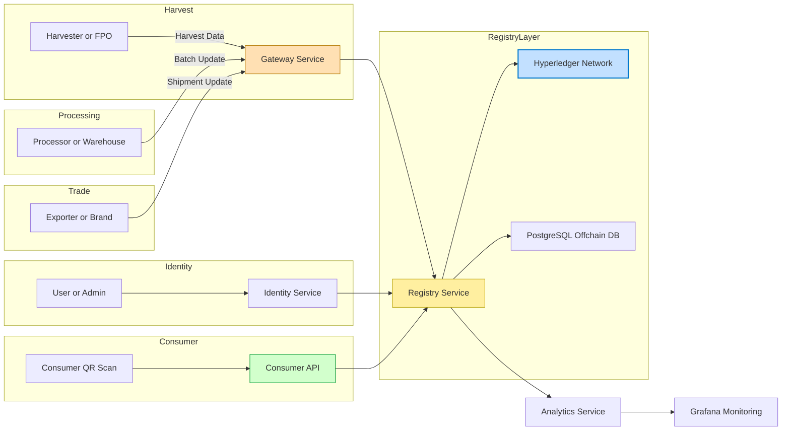
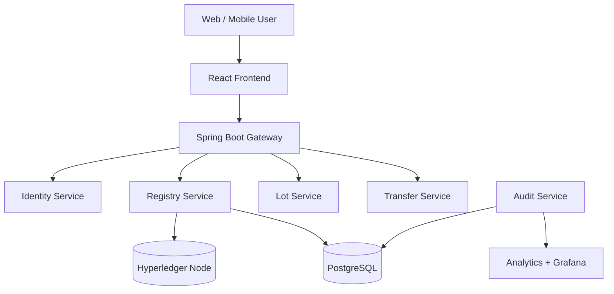
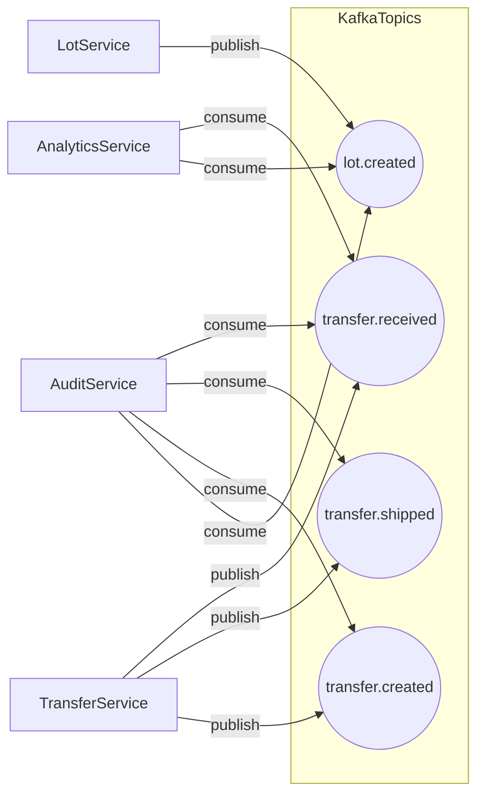
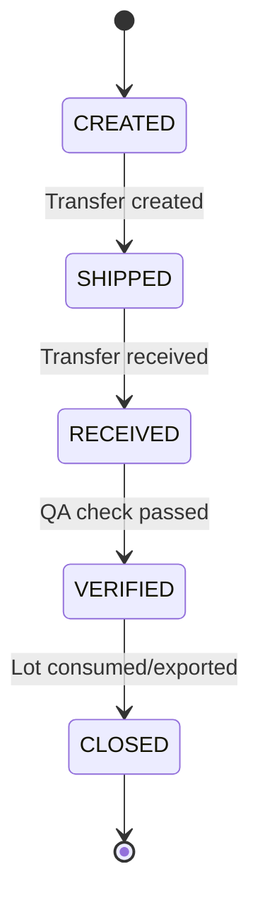
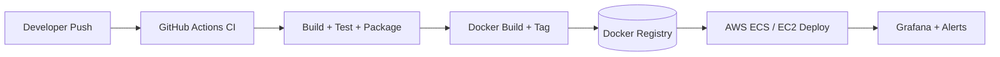
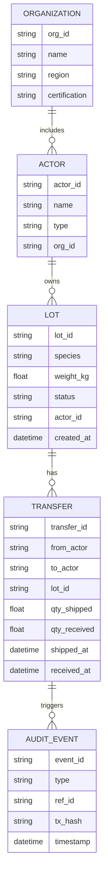
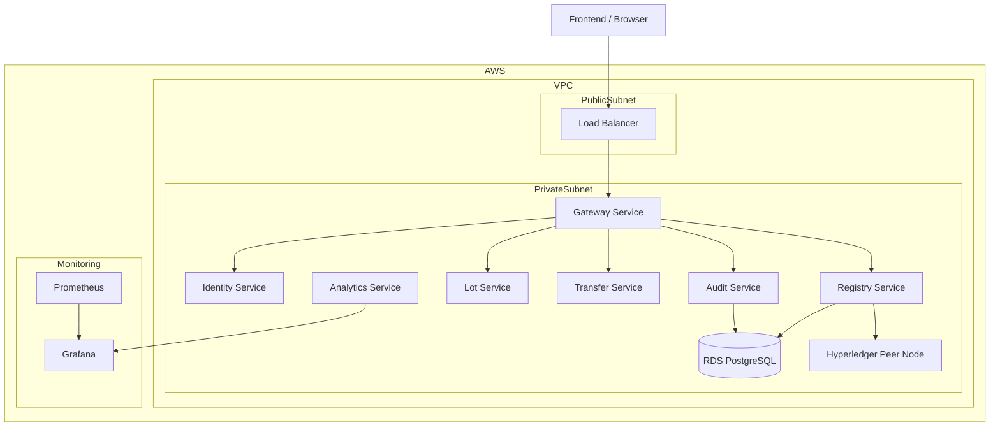
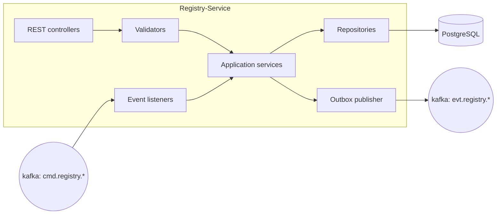
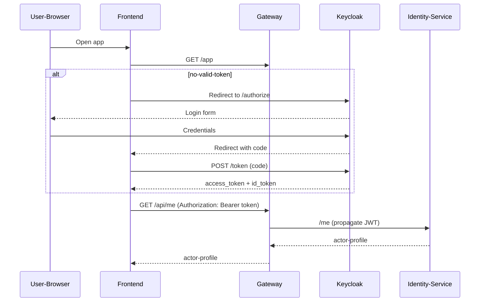

# Wyldtrace Architecture Documentation

---

## 1. Context Diagram

## 2. Container Diagram

## 3. Event Flow Map

## 4. Event Flow Map

## 5. CI/CD Pipeline Flow

---

## 6. Data Model (ER Diagram)

## 7. Deployment Topology (AWS Infrastructure)

## 8. Registry Service — Internal Component Diagram (C4 L3)

---

## 9. Login Sequence — OIDC Authorization Code (Recommended)
